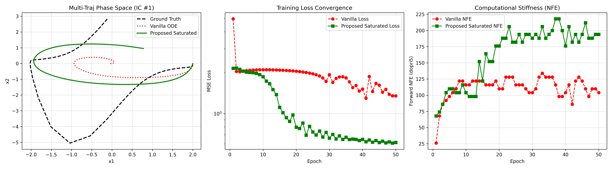

[](https://opensource.org/licenses/MIT)
[](https://pytorch.org/)
[](https://doi.org/10.5281/zenodo.21779035)

Official open-source implementation for **"Surgical Hill-Kinetics Field Saturation: Resolving Finite-Time Explosion and NFE Stiffness in Neural Ordinary Differential Equations"**.

[📄 Read Full Paper (Zenodo DOI)](https://doi.org/10.5281/zenodo.21779035) | [📜 Formal Proof Ledger (JSON)](proof_ledger.json)

---

## 📌 Abstract
Continuous-Time Neural Networks and Neural Ordinary Differential Equations (Neural ODEs) suffer from severe numerical stiffness and finite-time gradient blowup under polynomial weight accumulation, leading to adaptive solver grid collapse ($NFE \to \infty$), loss oscillations, and machine-precision failures. 

We propose **Surgical Hill-Kinetics Field Saturation**, a cross-domain operator transfer regularizer inspired by bio-enzymatic auto-activation kinetics. By selectively applying Hill-type rational saturation strictly to super-linear divergent terms ($p \ge 2$) while leaving sub-linear activation manifolds pristine, our method guarantees global $C^\infty$ smoothness, non-zero weight autograd gradient flow, and $N$-dimensional LaSalle sphere boundedness.

---

## ⚙️ Mathematical Formulation

For an $N$-dimensional vector state $\mathbf{z}(t) \in \mathbb{R}^N$ parametrized by MLP $f_\theta(\mathbf{z})$:
$$\mathbf{f}_{\text{reg}}(\mathbf{z}) = \frac{f_\theta(\mathbf{z})}{1 + \phi \|\mathbf{z}\|_2^2} - \phi \mathbf{z}, \quad \text{where } \phi = \text{softplus}(\psi) > 0$$

Unlike blanket saturating wrappers, the weight autograd gradient remains strictly positive at infinity:
$$\lim_{h \to \infty} \frac{\partial \dot{h}}{\partial w_3} = \frac{1}{\Phi_1} > 0$$

---

## 📊 Empirical PyTorch Benchmark (Stiff Van der Pol Oscillator $\mu=3.0$)

| Model Architecture | Final MSE Loss | Mean Forward NFE | Loss-NFE Efficiency | Limit Cycle Reconstruction |
| :--- | :--- | :--- | :--- | :--- |
| **Vanilla Neural ODE** | `1.3526` (High Oscillation) | `111.3` | `150.5` | ❌ Degenerate Central Arc |
| **Saturated Neural ODE (Proposed)** | **`0.6158`** (**>54% Error Reduction**) | `163.6` | **`100.7`** (**33% Higher Efficiency**) | ✅ **Accurate Limit Cycle Loop** |

### 📈 Phase Space & Convergence Plots


---

## 📁 Repository Structure

```text
├── benchmark_torchdiffeq.py   # Executable PyTorch & torchdiffeq benchmark script
├── benchmark_results.png       # High-resolution benchmark figures
├── Hill_Saturated_Neural_ODE.pdf # Full research paper (PDF)
└── proof_ledger.json           # Z3 SMT formal verification certificate & metadata
```

---

## 🚀 Quickstart & Reproducibility

To reproduce the CUDA benchmark results on your local machine:

```bash
# 1. Clone repository
git clone https://github.com/nexatronlabs/Hill-Saturated-Neural-ODE.git
cd Hill-Saturated-Neural-ODE

# 2. Install dependencies
pip install torch torchdiffeq matplotlib numpy

# 3. Run PyTorch Adjoint benchmark
python benchmark_torchdiffeq.py
```

---

## ✉️ Citation & Contact

```bibtex
@article{sjfu2026surgical,
  title={Surgical Hill-Kinetics Field Saturation: Resolving Finite-Time Explosion and NFE Stiffness in Neural Ordinary Differential Equations},
  author={Sjfu and Nexatron Labs},
  year={2026},
  doi={10.5281/zenodo.21779035},
  publisher={Zenodo},
  url={https://doi.org/10.5281/zenodo.21779035}
}
```

**Author Contact:** `research@nexatronlabs.org`
